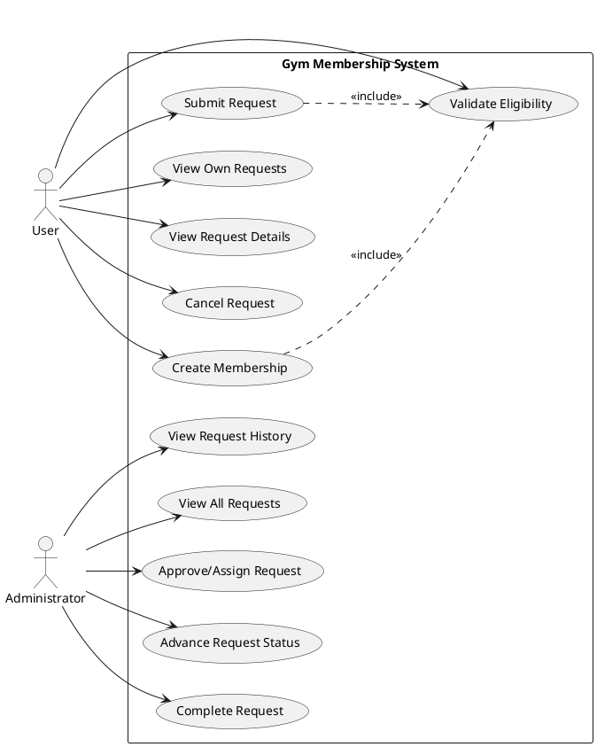
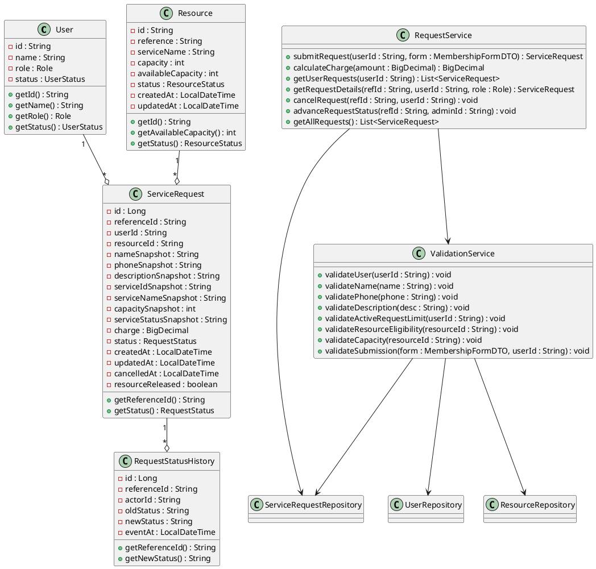

# UML Diagrams - Gym Membership System

## 1. Use Case Diagram

The use case diagram illustrates the interactions between the primary actors (User, Administrator) and the Gym Membership System. Users can create, submit, view, and cancel requests, while validation is an included behavior. Administrators manage requests by viewing them and advancing their state through to completion.

## 2. Class Diagram

The class diagram outlines the fundamental entities and services in the system. It demonstrates the domain model and service logic associations, detailing attributes, methods, and multiplicities like `User "1" --o "*" ServiceRequest`.

